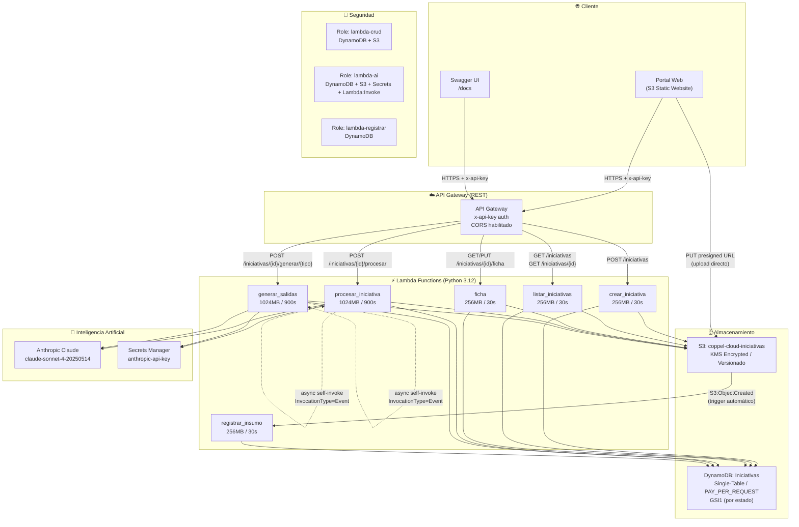
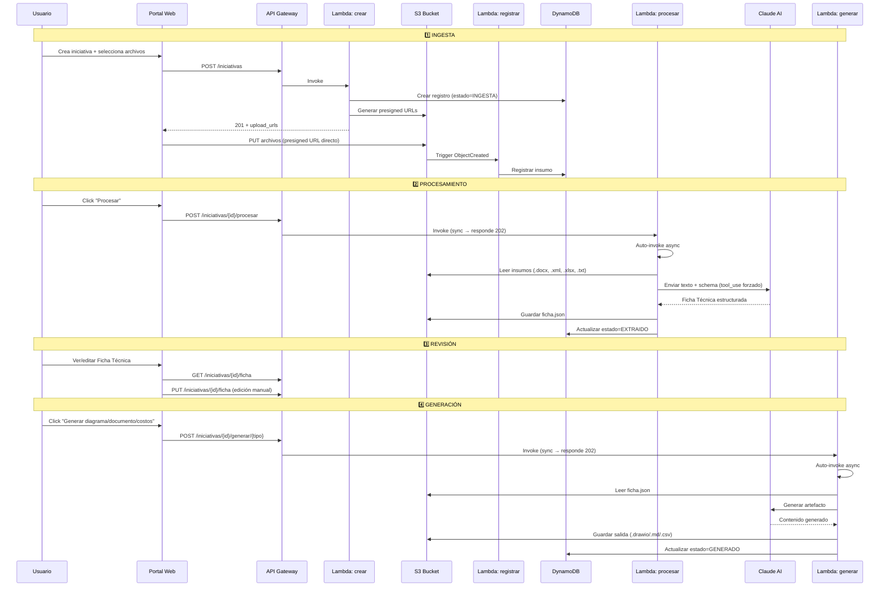

# Diagrama de Arquitectura — Coppel Cloud Validator



## Flujo de Datos



## Estructura de S3

```
coppel-cloud-iniciativas/
└── iniciativas/
    └── {id_iniciativa}/
        ├── insumos/
        │   ├── discovery/       ← .docx (Quick Discovery)
        │   ├── diagrama/        ← .xml (draw.io)
        │   ├── transcripciones/ ← .txt
        │   └── componentes/     ← .xlsx
        ├── ficha/
        │   ├── ficha.json       ← Ficha Técnica actual
        │   ├── ficha-v1.json    ← Versión anterior
        │   └── ficha-v2.json
        └── salidas/
            ├── diagrama.drawio  ← Generado por Claude
            ├── documento.md
            └── costos.csv
```

## Modelo DynamoDB (Single-Table)

| PK | SK | Descripción |
|----|-----|-------------|
| `INIT#<id>` | `META` | Metadata de la iniciativa |
| `INIT#<id>` | `EVENT#<timestamp>` | Eventos de auditoría |

**GSI1:** `GSI1PK = ESTADO#<estado>`, `GSI1SK = timestamp` → consulta por estado

## Recursos AWS Desplegados

| Servicio | Recurso | Región |
|----------|---------|--------|
| API Gateway | `coppel-cloud-prod-api` | us-east-1 |
| Lambda x6 | crear, listar, ficha, procesar, generar, registrar | us-east-1 |
| Lambda Layer | `coppel-cloud-prod-deps:5` (anthropic, pydantic, docx, openpyxl) | us-east-1 |
| DynamoDB | `Iniciativas` (PAY_PER_REQUEST) | us-east-1 |
| S3 | `coppel-cloud-iniciativas` (KMS, versionado) | us-east-1 |
| S3 | `coppel-cloud-portal` (static website) | us-east-1 |
| Secrets Manager | `coppel-cloud/anthropic-api-key` | us-east-1 |
| IAM | 3 roles (crud, ai, registrar) | global |
