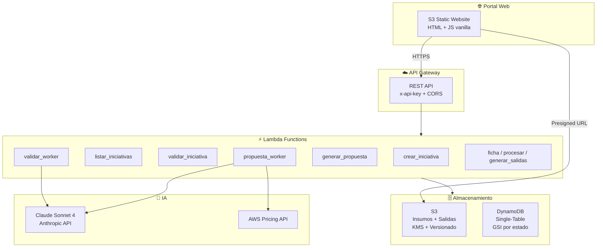

# CloudArch AI — Automatización de Propuestas de Arquitectura Cloud

## Área de Arquitectura Cloud · Coppel

---

## 1. Objetivo

Automatizar el proceso de análisis, validación y generación de propuestas de arquitectura cloud mediante inteligencia artificial, reduciendo el tiempo de entrega de **2-3 semanas** a **minutos**, eliminando reprocesos por información incompleta y estandarizando la calidad de los entregables.

---

## 2. Introducción

**CloudArch AI** es un portal serverless interno que permite al equipo de Arquitectura Cloud de Coppel:

- Recibir solicitudes de arquitectura de cualquier unidad de negocio
- Validar automáticamente la completitud de la información recibida
- Identificar servicios AWS necesarios usando IA
- Generar propuestas de arquitectura en formato Word con costos reales de AWS
- Mantener trazabilidad completa del ciclo de vida de cada iniciativa

El sistema opera 100% en AWS con un modelo serverless (pago por uso), sin servidores que administrar.

---

## 3. Problema que Resuelve

### Situación actual (sin la herramienta):

| Problema | Impacto |
|----------|---------|
| El Quick Discovery llega incompleto | El arquitecto pierde días pidiendo información faltante |
| No hay estándar de entregables | Cada arquitecto genera documentos con formato diferente |
| Estimación de costos manual | Se consulta la calculadora AWS servicio por servicio |
| Sin trazabilidad | No se sabe en qué estado está cada solicitud |
| Reprocesos constantes | Se regresa al solicitante 2-3 veces por datos faltantes |
| Tiempo de respuesta largo | 2-3 semanas desde la solicitud hasta la propuesta |

### Con CloudArch AI:

| Solución | Beneficio |
|----------|-----------|
| Validación automática con IA | Detecta huecos de información en segundos y pregunta lo faltante |
| Plantilla estandarizada | Todas las propuestas siguen el mismo formato profesional |
| Costos consultados vía AWS Pricing API | Estimación automática basada en servicios identificados |
| Dashboard de seguimiento | Visibilidad en tiempo real del estado de cada iniciativa |
| Flujo guiado | El solicitante no puede avanzar sin completar la información |
| Generación en minutos | De solicitud a propuesta Word en ~2 minutos |

---

## 4. Proceso: Ingesta → Análisis → IA → Salidas

```
┌─────────────┐    ┌──────────────┐    ┌─────────────────┐    ┌──────────────┐
│   INGESTA   │───▶│  VALIDACIÓN  │───▶│   EXTRACCIÓN    │───▶│  GENERACIÓN  │
│             │    │   CON IA     │    │  DE SERVICIOS   │    │  PROPUESTA   │
└─────────────┘    └──────────────┘    └─────────────────┘    └──────────────┘
```

### 4.1 Ingesta

El usuario sube los documentos de entrada al portal:

| Tipo de insumo | Formato | Contenido |
|----------------|---------|-----------|
| Quick Discovery | `.docx` | Documento con requisitos del proyecto |
| Transcripciones | `.txt` | Notas de reuniones con el cliente |
| Diagramas | `.drawio` | Diagramas existentes (si los hay) |
| Componentes | `.xlsx` | Inventario de componentes actuales |

- Los archivos se suben directamente a S3 mediante **presigned URLs** (sin pasar por el backend)
- Un trigger automático registra cada archivo en DynamoDB

### 4.2 Validación con IA (Claude)

La IA analiza los documentos y evalúa **8 secciones**:

1. **Metadata** — Nombre del proyecto, ambiente, responsables
2. **Requisitos** — SLA, usuarios concurrentes, disponibilidad
3. **Datos** — Volumen, tipo de datos, retención
4. **Dependencias** — Sistemas externos, APIs, integraciones
5. **Entorno / Red** — Conectividad, VPN, puertos
6. **Migración** — Origen, estrategia, ventana de migración
7. **Infraestructura** — Cómputo, storage, bases de datos
8. **Disaster Recovery** — RPO, RTO, estrategia de DR

**Resultado:** Puntaje por sección + lista de huecos críticos con preguntas específicas para el solicitante.

### 4.3 Extracción de Servicios AWS

Una vez validado (≥75% completitud), la IA identifica los servicios AWS necesarios:

- Clasifica por categoría (Cómputo, BD, Red, Seguridad, etc.)
- Asigna prioridad: REQUERIDO / RECOMENDADO / OPCIONAL
- Indica ambiente: Prod, QA, Dev, DR
- Justifica cada servicio basándose en el documento

### 4.4 Generación de Propuesta

Con los servicios identificados, el sistema:

1. **Consulta AWS Pricing API** — Obtiene precios reales por servicio
2. **Genera contenido con Claude** — Introducción, requisitos técnicos, premisas, arquitectura, consideraciones
3. **Produce documento Word** — Usando plantilla corporativa estándar con tabla de costos

**Salida final:** Archivo `.docx` descargable con la propuesta completa.

---

## 5. Salidas del Sistema

| Entregable | Formato | Descripción |
|------------|---------|-------------|
| Propuesta de Arquitectura | `.docx` | Documento Word con plantilla corporativa, 8 secciones + tabla de costos |
| Servicios AWS identificados | `.json` | Lista estructurada de servicios con justificación y prioridad |
| Validación de completitud | Dashboard | Puntaje por sección, huecos críticos, estado del análisis |
| Diagrama de arquitectura | `.drawio` | Diagrama generado automáticamente (fase futura) |
| Estimación de costos | Tabla en Word | Costos mensuales/anuales por servicio con totales |

---

## 6. Arquitectura de la Solución



### Flujo de datos:

```
Usuario → Portal → API Gateway → Lambda → DynamoDB/S3
                                      ↓
                                  Claude AI ← Secrets Manager
                                      ↓
                                  AWS Pricing API
                                      ↓
                                  Documento Word → S3 → Usuario descarga
```

---

## 7. Componentes Técnicos

### 7.1 Frontend
| Componente | Tecnología |
|------------|-----------|
| Portal web | HTML5 + CSS3 + JavaScript vanilla |
| Hosting | S3 Static Website |
| Páginas | `ingesta.html` (carga), `detalle.html` (seguimiento), `index.html` (análisis) |

### 7.2 Backend (Serverless)
| Lambda | Función | Timeout | Memoria |
|--------|---------|---------|---------|
| `crear_iniciativa` | Crear solicitud + presigned URLs | 30s | 256MB |
| `registrar_insumo` | Trigger S3 → registra archivo | 30s | 256MB |
| `listar_iniciativas` | Listado + detalle | 30s | 256MB |
| `validar_iniciativa` | Dispara validación async | 30s | 512MB |
| `validar_worker` | Valida docs con Claude | 300s | 512MB |
| `generar_propuesta` | Dispara generación async | 30s | 512MB |
| `propuesta_worker` | Genera Word con costos | 900s | 1024MB |
| `ficha` | CRUD ficha técnica | 30s | 256MB |
| `procesar_iniciativa` | Extrae ficha con Claude | 900s | 1024MB |
| `generar_salidas` | Genera diagrama/doc/csv | 900s | 1024MB |

### 7.3 Almacenamiento
| Servicio | Uso |
|----------|-----|
| **S3** | Insumos (.docx, .txt, .xlsx, .drawio), resultados JSON, salidas (.docx), prompts, plantillas |
| **DynamoDB** | Metadata de iniciativas, eventos de auditoría, estados del flujo |

### 7.4 Seguridad
| Componente | Implementación |
|------------|---------------|
| Autenticación API | API Key en API Gateway |
| Cifrado en reposo | S3 con KMS, DynamoDB cifrado |
| Secretos | Secrets Manager (API key Anthropic) |
| IAM | 3 roles con mínimo privilegio (crud, ai, registrar) |
| CORS | Configurado en todos los endpoints |

### 7.5 Inteligencia Artificial
| Componente | Detalle |
|------------|---------|
| Modelo | Claude Sonnet 4 (Anthropic) |
| Uso 1 | Validación de completitud del Quick Discovery |
| Uso 2 | Extracción de servicios AWS requeridos |
| Uso 3 | Generación de contenido para propuesta Word |
| Prompts | Almacenados en S3, versionados, editables sin redeploy |

### 7.6 Infraestructura como Código
| Herramienta | Archivos |
|-------------|----------|
| **Terraform** | `main.tf`, `s3.tf`, `dynamodb.tf`, `iam.tf`, `lambda.tf`, `apigateway.tf`, `apikey.tf`, `rds.tf`, `vpc_endpoints.tf` |
| Módulos | `modules/cors/` (reutilizable para OPTIONS en cada recurso) |

---

## 8. Conexiones e Integraciones

```
┌────────────────────────────────────────────────────────────────┐
│                    INTEGRACIONES                                 │
├─────────────────┬──────────────────────────────────────────────┤
│ Anthropic API   │ Claude Sonnet 4 — análisis y generación      │
│ AWS Pricing API │ Consulta de precios reales por servicio       │
│ Secrets Manager │ Almacén seguro de API keys                    │
│ S3 Events       │ Trigger automático al subir archivos          │
│ Lambda Async    │ InvocationType=Event para procesos largos     │
│ Presigned URLs  │ Upload directo del browser a S3               │
└─────────────────┴──────────────────────────────────────────────┘
```

---

## 9. Flujo de Estados de una Iniciativa

```
INGESTA → VALIDANDO → DISCOVERY_OK → EXTRAYENDO_SERVICIOS → EXTRAIDO → GENERANDO_PROPUESTA → GENERADO
                ↓                                                              ↓
           INCOMPLETO                                                    ERROR_PROPUESTA
        (pide info faltante)
```

---

## 10. Métricas de Valor

| Métrica | Antes | Con CloudArch AI |
|---------|-------|------------------|
| Tiempo de propuesta | 2-3 semanas | ~5 minutos |
| Reprocesos por info incompleta | 2-3 vueltas | 0 (validación previa) |
| Formato de entregables | Variable | Estandarizado |
| Trazabilidad | Ninguna | 100% (eventos en DynamoDB) |
| Costo de infraestructura | N/A | ~$5-15 USD/mes (serverless) |
| Consulta de precios AWS | Manual (calculadora) | Automática (Pricing API) |

---

## 11. Stack Tecnológico Resumen

| Capa | Tecnología |
|------|-----------|
| Frontend | HTML/CSS/JS → S3 Static Website |
| API | API Gateway REST + API Key |
| Compute | AWS Lambda (Python 3.12) |
| Storage | S3 + DynamoDB (Single-Table) |
| IA | Claude Sonnet 4 (Anthropic) |
| Costos | AWS Pricing API |
| Seguridad | IAM + KMS + Secrets Manager |
| IaC | Terraform |
| CI/CD | Manual (por ahora) |

---

## 12. Roadmap / Próximos Pasos

- [ ] Integrar **AWS MCP** (Model Context Protocol) para estimaciones de costos más precisas basadas en sizing
- [ ] Autenticación con **Cognito** (SSO corporativo)
- [ ] Dashboard ejecutivo con métricas de uso
- [ ] Generación automática de diagramas `.drawio` con IA
- [ ] Notificaciones por correo/Teams cuando cambia el estado
- [ ] Ambiente productivo con dominio personalizado

---

## 13. Demo en Vivo

**URLs del ambiente de desarrollo:**

- 🌐 Portal: `coppel-cloud-portal.s3-website-us-east-1.amazonaws.com`
- 🔌 API: `https://1vo8syihoe.execute-api.us-east-1.amazonaws.com/prod`

**Flujo a demostrar:**
1. Crear iniciativa con metadata
2. Subir Quick Discovery (.docx) + Transcripciones (.txt)
3. Validar documentos → ver puntaje y huecos
4. Extraer servicios AWS
5. Generar propuesta Word con costos
6. Descargar documento final

---

*Área de Arquitectura Cloud — Coppel · 2025*
